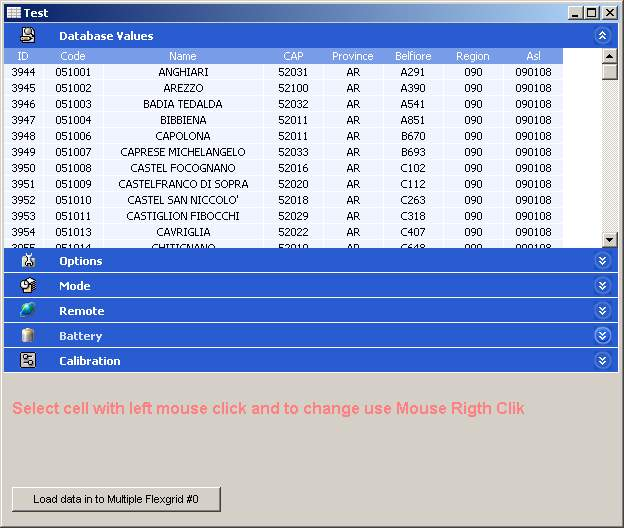



## Multiple Flexgrid ActiveX

### Description

Since many people asked me this, I made an ActiveX version of my Multiple FlexGrid project.

I have added the possibility to choose the number of tables (up to 10 for now), a real time scroll and a dynamic creation of the tables.

Update: it is now possible to control manually each flexgrid. In the example you can see how to connect to a database to show values in the multiple flexgrid.
 
### More Info
 

             |
---                |---
**Submitted On**   |2004-04-30 13:17:16
**By**             |[Lorenzo Nocentini](https://github.com/Planet-Source-Code/PSCIndex/blob/master/ByAuthor/lorenzo-nocentini.md)
**Level**          |Intermediate
**User Rating**    |5.0 (45 globes from 9 users)
**Compatibility**  |VB 6\.0
**Category**       |[Custom Controls/ Forms/  Menus](https://github.com/Planet-Source-Code/PSCIndex/blob/master/ByCategory/custom-controls-forms-menus__1-4.md)
**World**          |[Visual Basic](https://github.com/Planet-Source-Code/PSCIndex/blob/master/ByWorld/visual-basic.md)
**Archive File**   |[Multiple\_F174105542004\.zip](https://github.com/Planet-Source-Code/lorenzo-nocentini-multiple-flexgrid-activex__1-44794/archive/master.zip)

